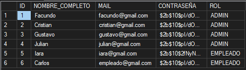

# 🗃️ StockWise

StockWise es una aplicación diseñada para pequeños y medianos comercios que buscan llevar un control eficiente de su inventario, ventas diarias, cierres de caja y gestión de empleados.
Su objetivo es ofrecer una solución simple, intuitiva y completa para optimizar las operaciones diarias del negocio.

## 🚀 Funcionalidades principales

📦 Gestión de stock
Registra, edita y controla el inventario de productos, con alertas por bajo stock.

💰 Control de ventas
Carga de ventas. Visualizacion estadísticas de ventas y ganancias.

🧮 Cierres de caja automáticos
Genera reportes diarios o por turno con detalle de ingresos.

👥 Gestión de empleados
Crea perfiles de usuario con distintos roles y permisos.


### 🛠️ Tecnologías utilizadas
Tipo	Tecnología
- Frontend: Angular
- Backend:	Node.js con Express
- Base de datos:	SQL Server
- Estilos: Tailwindcss
## ⚙️ Instalación y configuración

Clonar el repositorio

git clone https://github.com/StockWise-Team/StockWise-Grupo3.git

## 🌐 Instalar dependencias

### Levantar el Back End
cd StockWiseBack <br>
`npm install`

### Levantar el Front End
cd StockWiseFront <br>
`npm install`


### Configurar variables de entorno
Crea un archivo .env con las siguientes credenciales a la altura de src de StockWise-Back (ver el archivo .env.ejemplo):
```
USER_DB_LOCAL = 
PASSWORD_DB_LOCAL = 
SERVER_NAME_LOCAL = 
NAME_DB_LOCAL = 
PORT_DB_LOCAL =
```

### Agregar tablas con datos a la base
Ejecutar como consulta en SQL Server Managment Studio el contenido del archivo de la carpeta database -> `create_tables.sql`

### Usuarios ejemplo 
La contraseña de todos los usuarios es nuevo123


## ▶️ Ejecutar el proyecto

`npm run dev`


Acceder a la app Front
👉 http://localhost:4200

Acceder a la app Back
👉 http://localhost:3000

#🧑‍💼 Roles y permisos
### Administrador	
Acceso total a todas las secciones
Modificar inventario y precios

### Empleado	
Registrar ventas y cierres de caja

# 🧠 Próximas mejoras (roadmap)

Dashboard con métricas en tiempo real

Aplicación con diseño responsive (Android / iOS)

# 📚 Recursos Utilizados
https://www.svgrepo.com/collection/solar-bold-icons/

🪪 Licencia

Este proyecto se distribuye bajo la licencia MIT.
